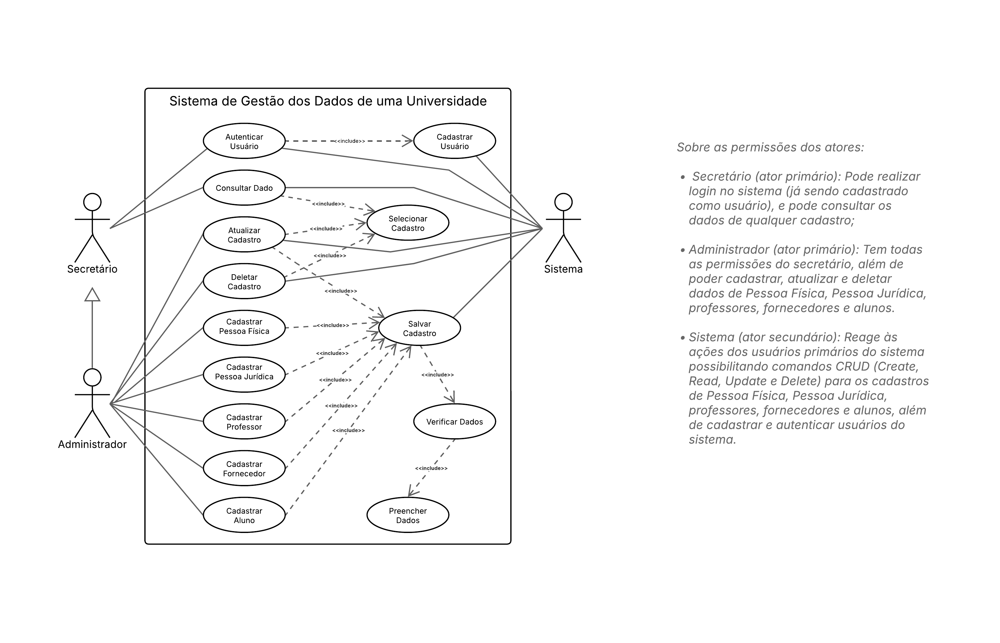
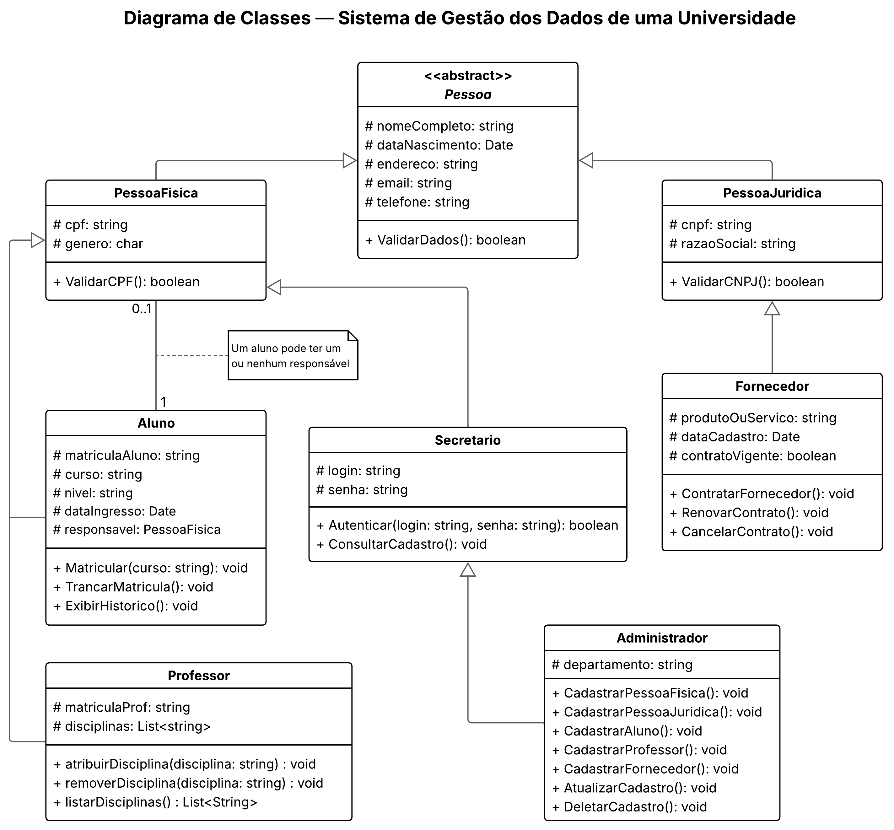

# SISTEMA UNIFICA  
Projeto Integrador: Desenvolvimento de Sistemas Orientado a Objetos - Grupo 12 

## 📌 Descrição
O **Sistema Unifica** é um projeto acadêmico desenvolvido com foco em **modelagem orientada a objetos** e prototipagem de interfaces, simulando um sistema de gestão de dados para uma universidade fictícia.  
O sistema foi pensado para organizar de forma padronizada os cadastros de diferentes perfis (Alunos, Professores, Fornecedores, Pessoas Físicas, Pessoas Jurídicas e Usuários do Sistema), garantindo clareza, usabilidade e controle de acesso.  

O projeto foi desenvolvido em duas etapas principais:  
1. **Modelagem (1ª entrega)** – Criação de diagramas UML (casos de uso, classes) e descrição de cenários.  
2. **Prototipagem e Implementação (2ª entrega)** – Desenvolvimento das interfaces no Figma e implementação das telas em **HTML, CSS e JavaScript puros**, utilizando dados estáticos apenas para simulação no front-end.  

---

## 👨‍👩‍👧‍👦 Integrantes do Grupo 12
- Alan Correa Barcelos  
- Bruno de Oliveira Januário  
- Fernanda Albuquerque Oliveira  
- Giuliana Beltrame Alves  
- Iago Viana Carvalho  
- Pedro Henrique Possebom
  
---

## ⚙️ Casos de Uso e Funcionalidades
O sistema foi modelado para atender diferentes **atores** e suas permissões:  

- **Secretário**: pode apenas **consultar dados**.  
- **Administrador**: possui acesso completo, podendo **cadastrar, consultar, atualizar e deletar cadastros, incluindo outros usuários**.  
- **Sistema (ator secundário)**: executa as operações solicitadas, valida dados e retorna mensagens de sucesso ou erro.  

### Casos de uso contempladados:
- Autenticar Usuário (login).  
- Consultar Cadastro (visualizar).  
- Cadastrar Pessoa Física.  
- Cadastrar Pessoa Jurídica.  
- Cadastrar Aluno.
- Cadastrar Fornecedor. 
- Cadastrar Professor.  
- Cadastrar Secretário.  
- Cadastrar Administrador.   
- Atualizar cadastro existente.  
- Deletar cadastro com confirmação.  
- Salvar e validar dados inseridos.  

---

## 🧩 Diagramas UML
Os diagramas elaborados refletem os cenários de uso e a estrutura do sistema:  

- **Diagrama de Casos de Uso**  
    

- **Diagrama de Classes**  
    

---

## 🖥️ Protótipos
Os protótipos de interface foram desenvolvidos no **Figma**, simulando todas as jornadas descritas nos casos de uso:  

- Tela de Login  
- Home – Secretário  
- Home – Administrador  
- Telas de Cadastro (7 perfis)  
- Telas de Consulta, Edição e Exclusão de Registros  

📎 Link para os protótipos no Figma: [SISTEMA UNIFICA – Projeto Completo de Prototipagem](https://www.figma.com/design/VTrktblFNdXOmUN1GWfsE8/SISTEMA-UNIFICA?node-id=0-1&p=f&t=DwvsWAIkEE89UmYn-0)  

📎 Screenshots das telas disponíveis na pasta [`prototipos/`](./prototipos/)  

---

## 🛠️ Tecnologias Utilizadas  
- **UML:** Diagrama de Casos de Uso e Diagrama de Classes para modelagem do sistema.  
- **Figma:** Prototipagem das interfaces de cadastro e consulta.  
- **HTML5 & CSS3:** Implementação das telas do front-end (cadastro, edição e listagem de registros).  
- **JavaScript:** Responsável pela interação dinâmica das telas, incluindo:
  - Validação de campos (ex.: CPF, CNPJ, datas);
  - Exibição condicional de campos (ex.: dados do responsável para menores de idade);
  - Botões de ação (editar, deletar).
 
> ⚠️ O projeto **não possui backend**. O objetivo da implementação é comprovar a viabilidade das telas desenvolvidas no processo de prototipagem.

---

## 🚀 Instruções de Uso
Para visualizar e testar as interfaces do **Sistema Unifica**:  

1. **Abrir o projeto localmente**  
   - Clone ou baixe a pasta [`arquivos-sistema-unifica/`](./arquivos-sistema-unifica/) para seu computador.  
   - Não é necessário instalar servidor ou banco de dados, pois todas as páginas usam dados estáticos.  

2. **Abrir o sistema pelo arquivo de login**  
   - Sempre inicie pelo arquivo `index.html` (página de login).  
   - O sistema já preenche automaticamente os campos de usuário e senha fictícios para Secretário e Administrador, portanto **não é necessário digitar nada**.  

3. **Navegação**  
   - **Login:** escolha o tipo de usuário (Secretário ou Administrador) e clique em Entrar.  
   - **Home Secretário:** acesse apenas o menu de consulta de cadastros, com botões de Voltar e Sair.  
   - **Home Administrador:** acesse menus de Cadastrar e Gerenciar Cadastros.  
   - **Telas de Cadastro:** preencha os formulários e clique em Salvar para validar a entrada de dados simulados.  
   - **Telas de Consulta/Editar/Excluir:** use os botões para navegar, editar ou excluir registros fictícios.  

4. **Observações**  
   - Todos os dados são **estáticos**, usados apenas para demonstração das interfaces.  
   - Nenhum dado será armazenado em banco de dados real.  
   - Para experimentar diferentes perfis, basta reiniciar o login como Secretário ou Administrador.

---

## 📂 Estrutura do Repositório
```plaintext
projeto-integrador-grupo-12/
│
├─ README.md                   # documentação do projeto em Markdown
├─ LICENSE                     # licença MIT do projeto
│
├─ diagramas/                  # diagramas UML da primeira entrega
│   ├─ diagrama-casos-de-uso.png
│   └─ diagrama-classes.png
│
├─ prototipos/                 # protótipos de tela da segunda entrega
│   └─ (screenshots dos protótipos desenvovidos com Figma)
│
└─ arquivos-sistema-unifica/   # arquivos da implementação do sistema
    └─ (HTML, CSS, JS do projeto)

